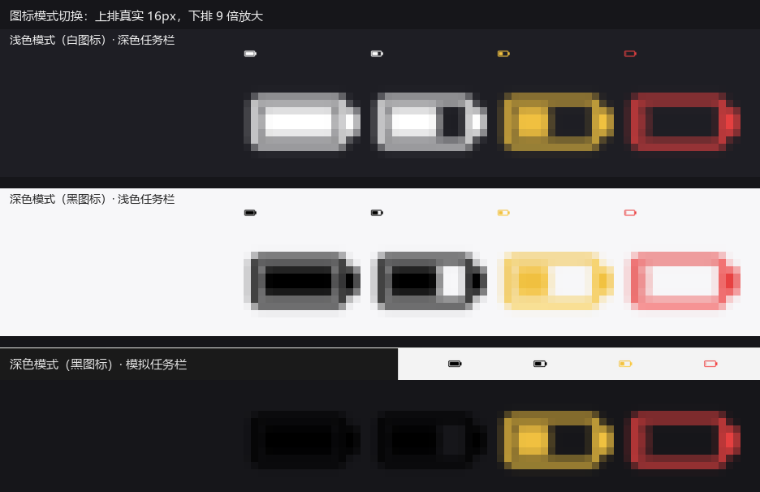

# Sora V3 电量托盘指示器

常驻 Windows 系统托盘，实时显示 **Ninjutso Sora V3** 无线鼠标的电量：图标随电量变色，低电量/充满自动弹通知，插线充电转青色显示，单击图标直达 ninjaforce 驱动设置页。

**[下载最新版](https://github.com/luxiaosaki-alt/SoraV3Battery/releases/latest)**：zip 解压即用，依赖已全部打包，无需安装 Python。


## 功能特性

- **实时电量图标**：30 秒自动刷新，电池图形 / 数字两种样式；>50% 白（可切换黑）、21–50% 黄、≤20% 红、充电中青、未连接灰，浅色/深色任务栏都清晰
- **电量提示**：20% / 10% 两级低电量通知与 100% 充满通知，每个充电/放电周期只报一次，绝不刷屏；菜单一键开关，阈值可调
- **有线充电显示**：插线时自动改读鼠标本体，图标转青色、悬停显示「充电中 N%」，此时低电量提示自动静音
- **快速直达**：单击/双击图标打开官方驱动设置页；菜单可立刻刷新、发送测试通知
- **省心常驻**：单实例互斥、计划任务自愈自启（进程被杀 2 分钟内自动回来）、有界轮转日志

## 安装与使用

**exe 方式（推荐）**：从 [Releases](https://github.com/luxiaosaki-alt/SoraV3Battery/releases/latest) 下载 zip，解压到任意目录后双击 `SoraV3Battery.exe`。要开机自启 + 崩溃自愈，再运行一次 `tools/install-task.ps1`（见[开机自启](#开机自启计划任务带自愈)）。

**源码方式**：

```sh
pip install -r requirements.txt
python main.py --once    # 只读一次电量并打印，用于验证协议
python main.py           # 常驻托盘
```

## 工作原理

鼠标 4K 接收器与有线模式下的鼠标本体都是 HID 复合设备，电量通过 **HID feature report** 读取（协议逆向自 [ClickSync](https://github.com/Nuitfanee/ClickSync)）：

| 项 | 值 |
|---|---|
| VID / PID | `0x093A` / `0xEB02`（接收器）、`0xE010`（有线本体） |
| 主通道 report ID | `0x06`（15 字节负载） |
| 电量命令 | `0x12` |
| 电量字节 | 回包 `byte[8]`（0–100） |

流程：`send_feature_report(REQ)` → sleep 12ms → `get_feature_report(0x06, 16)` → `resp[8]`。回包必须回显 report ID 与命令字，据此区分设备休眠/失联时的全零假包。

## 自定义

- **图标样式**：源码顶部 `ICON_STYLE` 选择 `"battery"`（电池图形，默认）或 `"digits"`（数字）
- **图标颜色**：右键菜单切换白色 / 黑色图标（适配深色 / 浅色任务栏），选择记忆在程序目录的 `sora_v3_battery.mode`
- **提示阈值**：程序目录 `sora_v3_battery.json` 的 `alert_warn` / `alert_urgent`（默认 20 / 10）
- **提示开关**：右键菜单「电量提示」，状态同样持久化



## 开机自启（计划任务，带自愈）

用**计划任务**实现开机自启：任务由计划程序服务托管、不依附任何父进程，配合「重复触发 + 失败重启」，进程被外部终止后最多 2 分钟内自动回来。

运行 `tools/install-task.ps1` 完成注册（无需管理员）：登录时触发 + 每 2 分钟重复（已在运行时被单实例互斥体挡掉，不会出现重复图标）；`ExecutionTimeLimit` 不限时；`LogonType=Interactive` + `RunLevel=Limited`。

若图标被 Windows 收进「隐藏的图标」溢出区，到 **设置 → 个性化 → 任务栏 → 其他系统托盘图标** 里把它打开。

## 从源码构建 exe

```sh
pip install pyinstaller
pyinstaller --noconfirm --onedir --windowed --name SoraV3Battery \
  --hidden-import pystray._win32 main.py
```

> 用 `--onedir` 而非 `--onefile`：启动更快，也避免了临时解压目录在受限环境下失败的问题。

## 开发

- **模块结构**：`main.py` 托盘与轮询 · `alerts.py` 电量提示状态机 · `protocol.py` 协议常量与回包校验
- **测试**：`python -m unittest discover -s tests -t .` —— 26 个单测（状态机 + 协议校验），无需任何第三方库
- 更多开发细节与踩坑记录见 [docs/开发笔记.md](docs/开发笔记.md)
