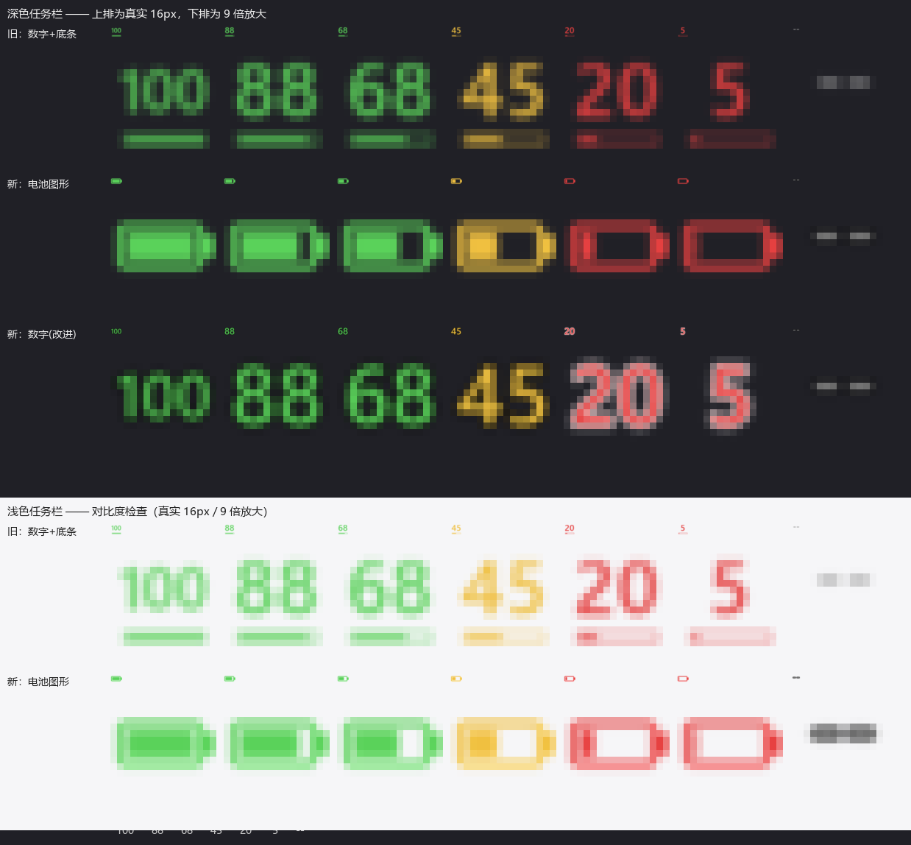

# Sora V3 电量托盘指示器

常驻 Windows 系统托盘（通知区），实时显示 **Ninjutso Sora V3** 无线鼠标的电量百分比，不必再打开官方驱动网页。


## 工作原理

鼠标 4K 接收器是一个 HID 复合设备，电量通过 **HID feature report** 读取（协议逆向自 [ClickSync](https://github.com/Nuitfanee/ClickSync)）：

| 项 | 值 |
|---|---|
| VID / PID | `0x093A` / `0xEB02` |
| 主通道 report ID | `0x06`（15 字节负载） |
| 电量命令 | `0x12` |
| 电量字节 | 回包 `byte[8]`（0–100） |

请求包（hidapi 视角，含 report ID 共 16 字节）：

    [0x06, 0x12, 0x00, 0x00, 0x01, 0x00, 0x00, 0x00,
     0x00, 0x00, 0x00, 0x00, 0x00, 0x00, 0x00, 0x00]

流程：`send_feature_report(REQ)` → sleep 12ms → `get_feature_report(0x06, 16)` → `resp[8]`。

### 一个必须注意的坑

接收器的 `MI_02` 接口上有**两个** usage_page/usage 完全相同的 HID collection：

    iface=2 usage_page=0xFF01 usage=0x0001   ← Col04：open 后读取必然失败
    iface=2 usage_page=0xFF01 usage=0x0001   ← Col06：真正能读电量

它们用 `usage_page`/`usage` **无法区分**，所以程序必须逐个尝试（见 `read_battery()`），成功过的路径会被缓存。

## 依赖

- Python 3.10+
- [hidapi](https://pypi.org/project/hidapi/)（`import hid`）— HID 通信，Windows 免驱
- [pystray](https://pypi.org/project/pystray/) — 系统托盘
- [Pillow](https://pypi.org/project/Pillow/) — 绘制图标

```sh
pip install -r requirements.txt
```

## 使用

```sh
python main.py --once    # 只读一次电量并打印，用于验证协议
python main.py           # 常驻托盘
```

托盘图标含义：数字为电量百分比，颜色随电量变化（>50% 绿 / 21–50% 黄 / ≤20% 红），底部有比例电量条；鼠标未连接时显示 `--`，悬停提示「Sora V3: 未连接」。右键菜单可退出。

## 打包成 exe

```sh
pip install pyinstaller
pyinstaller --noconfirm --onedir --windowed --name SoraV3Battery \
  --hidden-import pystray._win32 main.py
```

> 用 `--onedir` 而非 `--onefile`：onefile 会把带受限 DACL 的 `_MEI*` 解压目录建在临时目录里，在受限环境下会直接失败（`Failed to create parent directory structure`）。onedir 启动也更快。

## 开机自启（计划任务，带自愈）

用**计划任务**而不是「启动」文件夹快捷方式：任务由计划程序服务托管、不依附任何父进程，还能配「重复触发 + 失败重启」，进程被外部终止后可以自己回来。

运行 `tools/install-task.ps1` 完成注册（无需管理员）。三个关键点：

- 触发：**登录时** + **每 2 分钟重复**（持续 3650 天）。已经在跑的时候，重复触发会被程序的单实例互斥体挡掉，因此不会出现重复图标；被杀了则最多 2 分钟内自动重启。
- 设置：`ExecutionTimeLimit` 必须是**不限时**，否则计划程序会在默认 3 天后把常驻进程干掉；`MultipleInstances=IgnoreNew` 防并发。
- 主体：`LogonType=Interactive` + `RunLevel=Limited`，托盘程序需要桌面会话，且不需要管理员权限。

> 之前用「启动」文件夹快捷方式，缺陷是只有登录这一次机会：进程一旦被终止，就没有任何机制把它拉起来，图标就此消失。

若图标被 Windows 收进「隐藏的图标」溢出区，到 **设置 → 个性化 → 任务栏 → 其他系统托盘图标** 里把它打开。

## 开发环境说明

### `pipfix/` 是什么

`pipfix/sitecustomize.py` 是**特定受限环境**下的 workaround，不属于程序本身。某些沙箱按 `os.mkdir` 传入的 mode 判定写入权限，而 `tempfile.mkdtemp()` 用的正是 `0o700`，结果目录刚建出来就不可写 —— pip 会直接失败（`Permission denied: .../pip-unpack-xxxx/xxx.whl`），任何依赖 mkdtemp 的工具同理。

把它放进 `PYTHONPATH`，解释器启动时会自动导入 `sitecustomize`，把 `0o700` 改写成 `0o777` 即可绕过：

    set PYTHONPATH=<repo>\vendor;<repo>\pipfix

普通 Windows 环境**不需要它**，删掉不影响程序运行。

### 为什么没有 `vendor/`

`vendor/` 是从 wheel 解压出来的第三方包，属于依赖而非源码，已写进 `.gitignore`。构建前先按 `requirements.txt` 装依赖，再执行下面「打包成 exe」。

## 图标渲染

托盘图标由 Pillow 现画，不用静态资源。三个关键点：

1. **按 32×32 渲染，不是越大越好。** pystray 用 `LoadImage(..., LR_DEFAULTSIZE)` 载入图标，无论传入多大的图都会被重采样到 `SM_CXICON`（本机 32×32）。实测：

   | 传入 | 拿到的 HICON |
   |---|---|
   | 16×16 | 32×32 |
   | 32×32 | 32×32 |
   | 64×64 | 32×32 |
   | 128×128 | 32×32 |

   所以画 64 会经历「64→32（pystray）→ 16（托盘）」**两次廉价滤波** = 糊；按 32 渲染只剩托盘那一次。这正是旧版数字发虚的原因。
2. **内部 4 倍超采样，再用 LANCZOS 缩回 32**，边缘才干净。
3. **字号按「一组候选串」拟合**，而不是按当前这一个串：两位数按最宽的 `"99"` 定字号，`"100"` 单独一档。否则电量每跳一格数字大小就变一次，看着很跳。

样式由文件顶部的 `ICON_STYLE` 选择：`"battery"`（默认，电池图形）或 `"digits"`（直接画数字）。未连接时两种样式都退化成灰色 `--` —— 空电池会被误读成 0%。



## 实现要点

- **单实例**：命名互斥体 `Local\SoraV3BatteryTray`，避免重复启动出现多个图标。
- **短连接**：每次读取都新建/关闭 HID 句柄，鼠标睡眠或重连时最稳。
- **读取失败绝不抛异常**：任何 I/O 异常都降级为「未连接」，30 秒正常轮询、未连接时 5 秒重试。
- **异常落盘**：`--windowed` 下 `sys.stderr` 为空，未捕获异常会静默消失，因此崩溃会写进 `sora_v3_battery.log`。
- **日志有界**：用 `logging.handlers.RotatingFileHandler` 做大小轮转，单文件上限 512 KiB、保留 1 个 `.1` 备份，总占用始终 ≤ 1 MiB。30 秒一次的轮询每天约产生 140 KB 日志，不轮转会无界增长。

## 踩坑记录

1. **pystray 传了 `setup` 回调就不会自动显示图标**。源码 `_start_setup`：只有 `setup` 为 `None` 时才执行 `self.visible = True`。传了回调必须自己设 `icon.visible = True`，否则 `Shell_NotifyIcon` 根本不会调用，图标永远不会出现（而且不会报任何错）。
2. **`--windowed` 下 `print()` 会抛异常**（`sys.stdout is None`），在 PyInstaller 里会弹出模态错误框导致进程卡死。输出统一走 `_say()`。
3. 打包环境若受限（如低完整性令牌），`ChangeWindowMessageFilterEx` 会抛 `WinError 5`；该调用只是用来捕获 explorer 重启，失败不该致命，故做了兼容 shim。
